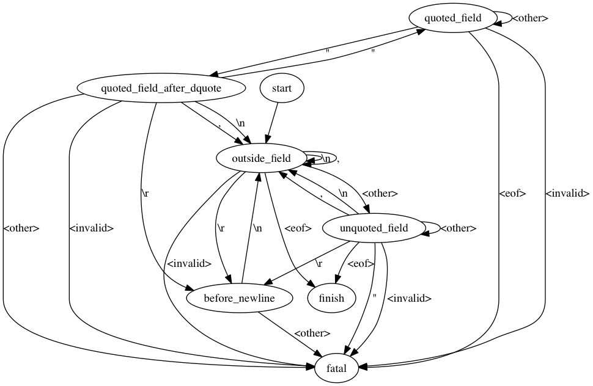

# OVERVIEW

Convert a UTF-8 encoded CSV file to a UTF-8 encoded TSV file.

# DATA DEFINITIONS

CSV format: [RFC 4180](https://tools.ietf.org/html/rfc4180).

TSV format: [IANA](https://www.iana.org/assignments/media-types/text/tab-separated-values).

One goal of this code is to never produce invalid input.  That is, the output should always be in TSV format.

One requirement of a TSV file is to have a header, but note that it is not required for a CSV file to have a header.  Also, there is no reliable way for code to distinguish a header row from a non-header row, so the code can't really guarantee the presence of a header in the output.  The user should inspect the input CSV for a header, and use the `--header` flag to provide one if it is missing.  We recommend using `.tab` instead of `.tsv` for tab-delimited files that don't have a header.

Another requirement of a TSV file is for each row to have the same number of fields.  This is also a requirement of a CSV.  By default, the command fails if the input does not have the same number of fields in each row.  The optional `--pad` flag can be used to add empty fields to short rows. *What about long rows?*

CSV files are supposed to use CRLF to terminate records.  As a convenience, the code will also accept a document which uses LF to terminate records, or even a mix of CRLF and LF.  The code does not accept CR as a record terminator, even though some CSV producers--e.g. Excel on Mac--produce this format.  Accepting a mix of CRLF, LF, and CR would make the number of line endings ambiguous.  Use `sed` to convert such a file.

The TSV format does not specify the exact format of the EOL.  We use LF.

The TSV format cannot include tabs or EOL.  To be safe, we prohibit any character that might be interpreted as an EOL according to the Unicode consortium.  The default behavior is to fail.  Options are provided to strip, backslash escape, or replace with a space character.  The choice of default is motivated by the desire to not modify the data without the explicit permission of the user.

*CSV variations the Python accepts and the C doesn't?*

# CHARACTER ENCODING

The data standards we follow don't specify the character encoding.  We use UTF-8.  Use `iconv` or some other conversion tool to convert to this format.

*Error handling when not UTF-8?*

# FLAGS

    -x --strip
    -r --replace
    -e --escape
    -p --pad NUM_FIELDS
    --header NAME,NAME,...

# STATE MACHINE

This describes the state transitions of the C code in the default mode; i.e. when no flags are set.

# TESTS

A test which exercises each transition.

A test which exercises each flag.

Tests for error conditions:

* not UTF-8
* not correct number of rows
* invalid TSV characters

# SPEED

Profiling info.

Benchmark against the Python code.

